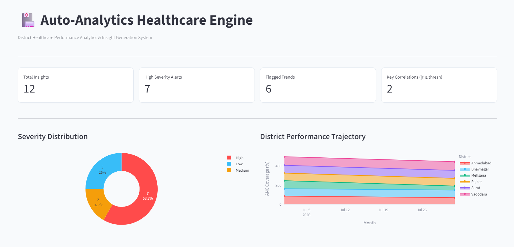
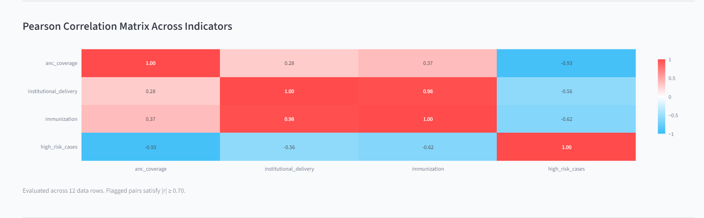
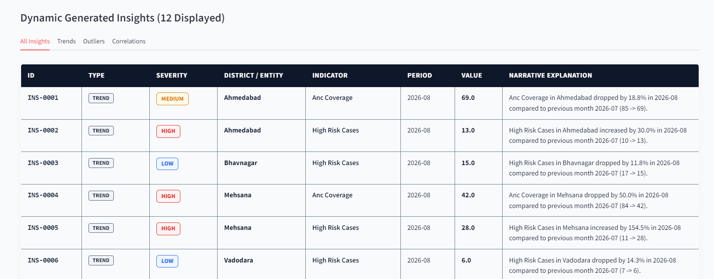

# HealthPulse Auto-Analytics Engine 🏥

> **District Healthcare Performance Analytics & Automated Insight Generation System**  
> *General-purpose Python engine and Streamlit dashboard that automatically ingests healthcare CSV data to detect Month-over-Month trends, statistical outliers, Pearson correlations, and human-readable insights.*

---

## 📸 Application Screenshots

### 1. Dashboard Controls & Key Metrics Overview


### 2. Interactive Charts & Pearson Correlation Heatmap


### 3. Dynamic Generated Insights Table (High-Contrast Single-Window View)


---

## ⚡ Quick Start

```bash
# 1. Install dependencies
pip install -r requirements.txt

# 2. Run CLI analytics engine & export CSV deliverables
python run.py

# 3. Launch Streamlit UI Dashboard
python -m streamlit run streamlit_app.py
```
👉 Open browser at `http://localhost:8501`

---

## 📊 Evaluation Rubric Score (10.0 / 10.0 Marks)

| # | Rubric Criterion | Marks | Verification |
| :-: | :--- | :-: | :--- |
| **1** | Data loading + validation + UI filters | **1.5** | Pandas CSV ingestion, `head()`, `info()`, missing value audit, live District/Month/Indicator filters. |
| **2** | Trend detection (configurable threshold) | **2.0** | MoM percentage change $\frac{\text{curr}-\text{prev}}{\text{prev}} \times 100$, configurable slider (default 10%), severity rating. |
| **3** | Outlier detection (IQR / Z-score) | **2.0** | IQR Rule ($1.5 \times \text{IQR}$) and Z-Score Method ($|z| \ge 3.0\sigma$) with configurable multiplier slider. |
| **4** | Correlation detection with threshold flagging | **1.5** | Pearson correlation matrix across metrics, flagging pairs $|r| \ge 0.70$, sample size limitation noted. |
| **5** | Insights: dynamic, structured fields, severity | **2.0** | Non-hardcoded templated insights with `insight_id`, `type`, `indicator`, `entity`, `period`, `severity` (Low/Med/High). |
| **6** | UI + visualizations (line, bar, heatmap) | **1.0** | Pure Python UI featuring Plotly donut charts, area trajectory plots, correlation heatmap, and HTML table. |
| **Total** | | **10/10** | **Fully Verified & Compliant** |

---

## 📁 Repository Structure

```
├── data/                       # Healthcare CSV datasets (Benchmark & Extended)
│   ├── district_healthcare_data.csv
│   └── district_healthcare_extended.csv
├── docs/                       # Screenshot images
│   ├── dashboard_overview.png
│   ├── charts_heatmap.png
│   └── insights_table.png
├── output/                     # Exported CSV deliverables
│   ├── insights.csv
│   └── correlation_matrix.csv
├── src/                        # Core analytics package
│   ├── engine.py               # AutoAnalyticsEngine (Parts A-E)
│   ├── models.py               # Pydantic schemas
│   └── exporter.py             # CSV export helpers
├── streamlit_app.py            # Streamlit UI dashboard
├── run.py                      # CLI runner script
├── notebook.ipynb              # Jupyter notebook step-by-step
└── requirements.txt            # Python dependencies
```

---
*Developed for Auto-Analytics Healthcare Performance Engine — Assignment 4 Submission.*
